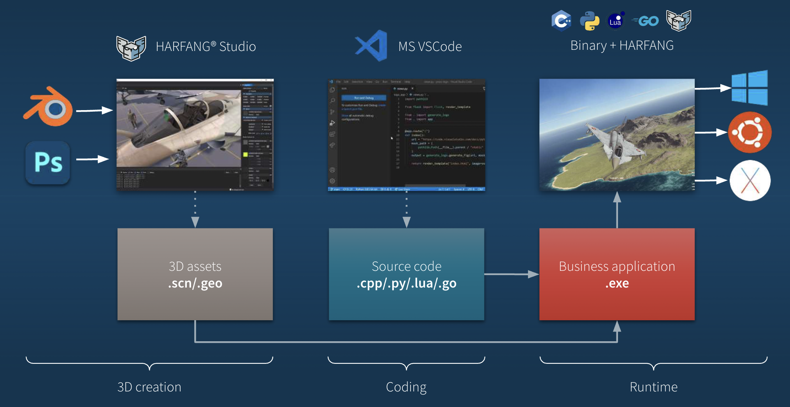
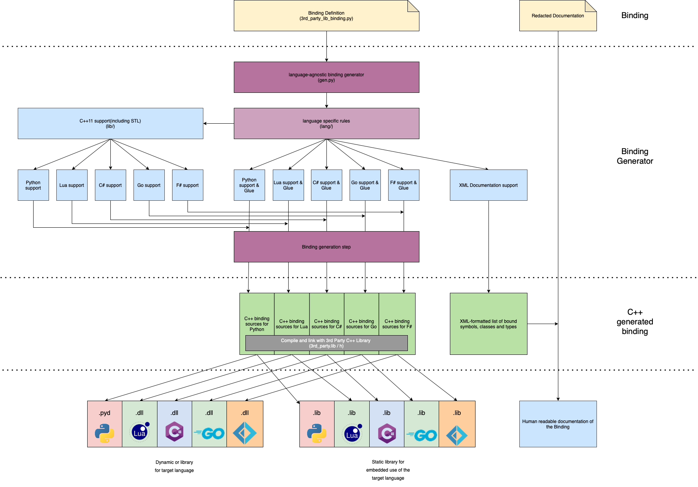

 Binding F# 

 Functional Specification

 

 Thomas Planchard

 

 ALGOSUP, Group 3. All Rights Reserved. 

# Summary

Table of content

    
- [Summary](#summary)
- [Context](#context)
- [Goal](#goal)
- [Functional requirements](#functional-requirements)
- [Acceptance criteria](#acceptance-criteria)
- [Personae](#personae)
- [Design](#design)
- [Non-functional requirements](#non-functional-requirements)
- [Constraints and assumptions](#constraints-and-assumptions)
- [Security](#security)
- [Glossary](#glossary)

 
 

# Context
HARFANG®3D is a 3D engine that allows professionals to create 3D games and applications. HARFANG®3D builds real-time 3D tools for industry professionals. Its software suite is tailored to developers, designers and engineers aiming to efficiently and seamlessly develop, implement & deploy 3D solutions (HMI, VR/AR, simulation, interactive 3D), regardless of development language or platform constraints. FABGen was written for the HArfang3D project to bring the C++ engine to languages such as Python, Lua and Go. It serves as a replacement for SWIG, a widely-used binding generator that supports a multitude of target languages. However, due to certain limitations, the team at HARFANG®3D created an alternative binding generator.
# Goal
FABGen is a dependency of HARFANG®3D project to bring the C++ engine to languages such as Python, Lua and Go. It was written as a replacement for SWIG, a very well-known binding generator supporting a lot of target languages. SWIG has different issues and that's why HARFANG®3D company create another binding generator. And our objective is to create a binding for F#.  
The goal is to implement F# in FABGen to allow non-coding experts to have access to this software. C++ is a very specific language for non-coding experts people so implementing other languages such as Python, F# and Rust allows other experts to easily use FABGen. Adding F# to FABGen will benefit the F# users who need a 3D engine. In addition, people looking for an alternative to SWIG when binding a C++ library to F# might find it useful. F# is known for being a relatively concise and easy to learn language, which can allow you to write code more quickly and with fewer errors. Also, F# uses the .NET "int" data type, which is natively optimized for mathematical calculations and bit operations, which can make F# code runs faster than code which is written in other languages.  
Attached below is a diagram illustrating the relationship between HARFANG®3D and FABGen in this project.

**Company distribution**
| Person           	| Company role         	| Contact                        	|
|------------------	|----------------------	|--------------------------------	|
| François Gutherz 	| CTO & Project leader 	| francois.gutherz@harfang3d.com 	|
| Emmanuel Julien  	| Lead developer       	| emmanuel.julien@harfang3d.com  	|
# Functional requirements 
To create a binding for F# in FABGen, we need to do the following tasks:
- Being able to run FABgen to generate the existing binding layers to Cpython and Lua (easiest target to deal with).  
 - Being able to run FABGen to generate the binding to Go.
 - Run the unit tests.
 - Examine how the Go binding work.
 - Our F# binding should be based on gen.py, as much as possible but of course, gen.py was mainly written for Cpyton and Lua (interpreted languages) so we will have to specialize some of the code.
 - Map the types and implement the features required by the tests, starting with the "easy" ones ("basic_type_exchange.py", "function_call.py"), here: https://github.com/ejulien/FABGen/tree/master/tests
- Ultimately, improve the integration with the target language. 

# Acceptance criteria
In this category, we will list the acceptance criteria for the F# binding. The acceptance criteria are the conditions that must be met in order to consider that the F# binding is complete. The acceptance criteria are the following:
- The F# binding must be able to run the unit tests.
- FABgen must be able to generate the binding for CPython, Lua, Go and F#.
- The binding must be integrated into FABGen and made available to users.
# Personae
| Name   	| Age 	| Role| Description  	|
|--------	|-----	|-------------|----------|
| James  	| 35  	| software developer| James is a software developer with over 10 years of experience in the industry. He is an expert in F# and has a particular interest in using 3D engines to create interactive and visually stunning applications. 	|
| Rachel 	| 20  	| student | Rachel is a computer science student with a strong interest in 3D graphics and F#. She would like to combine her two passions to create a new game.                                                                	|
| Gérard 	| 50  	| senior dev | Gerard is a senior developer. He often uses Harfang3D and to improve his skills, he wants to learn F# and be able to use his new skills on Harfang3D.                                                             	|
# Design
Below is a diagram of FABGen and existing bindings. The F# binding will be added to this diagram. We need to apply the same principle as the other bindings to F#.  

# Non-functional requirements
Non-functional requirements for our solution are the following:

| Requirement 	| Description 	|
|--------	|-----	|
| Performance   	| The binding generator must be able to generate bindings for large code bases in a reasonable amount of time. 	| 
| Scalability  	|  The binding generator must be able to handle increasing numbers of source code files and dependencies as the codebase grows.| 
|Robustness| The binding generator must be able to function correctly and efficiently even in the presence of unexpected or unusual inputs, conditions, or circumstances. Specifically, to the ability to use a C++ library in F# without experiencing any memory leaks or issues.| 
| Security 	| The binding generator should not introduce any security vulnerabilities to the generated code or to the system on which it is run.| 
| Usability 	|The binding generator for F# should be as close as possible to the original paradigms and coding standards of F#.	|  
| Compatibility 	| The generated binding code should be compatible with the target programming language, operating system (Win32, Win64 Intel, Linux 64 Intel and Aarch 64 ARM), and other technologies and libraries. SEE: https://github.com/algosup/2022-2023-project-3-harfang3d-binding-Project-3-group/blob/main/Documents/Technical-Specifications/technical-Specification.md	|   
| Maintainability 	| The binding generator should be easy to maintain and should be designed in such a way that it is easy to fix bugs and add new features in the future.|   

# Constraints and assumptions

In this section, we will list the constraints and assumptions that we have made for our project. The constraints and assumptions are the following:
- If we forgot to implement a function, it will not be possible to use it in F# and maybe it will create an error.
- The binding generator should validate all input and reject any that does not meet specific requirements or may be harmful.

# Security
For the security part, we haven't added anything new that is not already implemented in the current version of FABGen: 
- **Defense in depth**: the Binding generator should provide multiple layers of security in order to make it harder for an attacker to find and exploit a vulnerability.
- **Least privilege principle**: The binding generator should run with the minimal access and privilege level required for its task.
- **Input validation**: The binding generator should validate all input and reject any that does not meet specific requirements or may be harmful.
# Glossary
| Term   	| Definition 	| 
|--------	|-----	|
| HARFANG®3D  	| HARFANG®3D is a software that allows developers to create 3D computer graphics applications, such as video games, simulations, and animations.  	| 
| F# 	| F# is a functional-first programming language that was developed by Microsoft. F# is characterized by its strong static typing, pattern matching, and support for functional programming concepts such as first-class functions, immutability, and higher-order functions.  	| 
| Lua 	| Lua is a lightweight, high-performance programming language that is widely used as an embedded scripting language in many applications, such as video games, web servers, and other software.  	| 
| GO 	| Go (often referred to as Golang) is a programming language developed by Google in 2007. Go was designed to be a fast, efficient, and statically typed language that is easy to learn and use, with a focus on simplicity, readability, and reliability.  	|  
| Python 	| Python is an interpreted language, and it supports multiple programming paradigms such as object-oriented, functional and procedural, making it a versatile and adaptable language.  	|   
| CPython  	| CPython is the reference implementation of the Python programming language. It is written in C and is the most widely used implementation of Python. CPython is an interpreted language, meaning that the source code is not compiled to machine code before it is executed, rather the interpreter reads and executes the code directly.|  
| C++ 	| C++ is a high-performance, general-purpose programming language that was developed in the early 1980s as an extension of the C programming language. C++ is a strongly typed, compiled language that supports both imperative and object-oriented programming styles.  	| 
| Swig 	| SWIG (Simplified Wrapper and Interface Generator) is an open-source software development tool that is used to create interfaces between high-level programming languages and C or C++ code. It is particularly useful for creating bindings between C/C++ libraries and languages such as Python, Perl, Ruby, Lua, and others.| 

